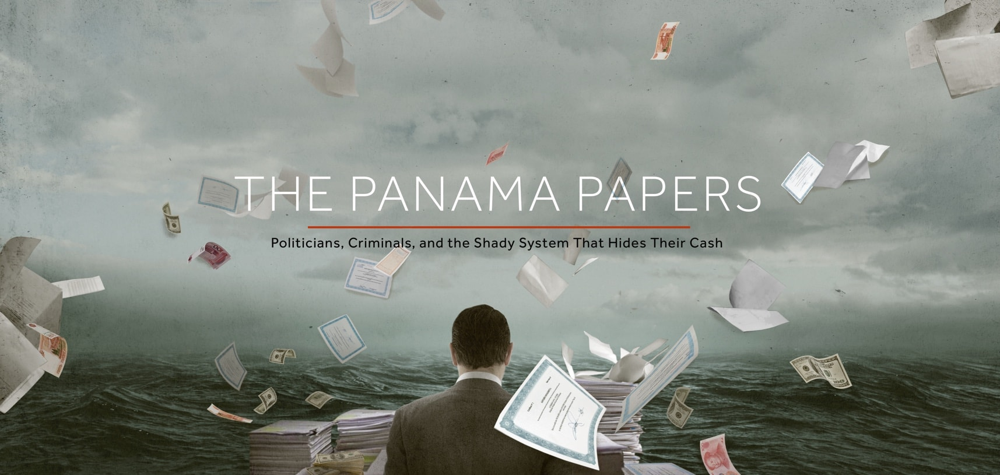
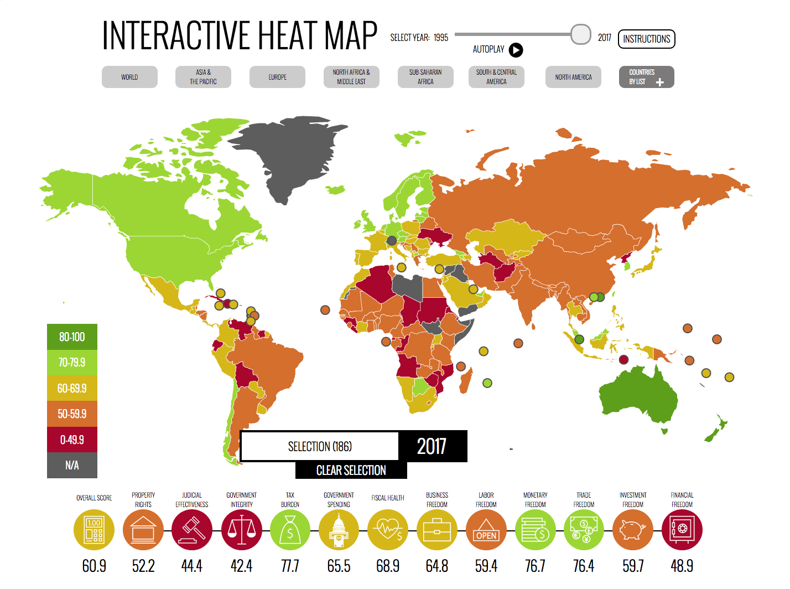

# Inside Panama Papers

# Abstract
As global markets expand and become more interconnected, businesses are increasingly looking for resources to help identify competitive and profitable opportunities. Several data leakages in the last years have shown that a common approach to this is the creation of offshore companies, i.e. companies created in low-tax, offshore jurisdictions.
Our goal is to analyze motivating factors for creating
such entities. We believe that a better understanding of the reasons can help to find ways to deal with those tendencies. This has an impact on the social good, because fiscal prudence and opennesss in international trade can have a powerful effect on improving society.
The data analysis is performed using the [Offshore Leaks Database](https://www.occrp.org/en/panamapapers/database) which contains data about offshore companies, foundations and trusts. We enrich the dataset with information about the economical and social background of countries from the [Index of Economic Freedom](http://www.heritage.org/index/about), considering legal factors as well.  

# Research questions
1. Which economic factors motivate the foundation of offshore companies? 

2. Which role does the legal situation in the origin country play compared to the legal situation in the offshore country? In particular, are off-shores used also to avoid  higher wages and better working conditions imposed by countries legislation?

3. How are the countries connected? Is there a pattern in the way players in origin countries select special countries for their offshores? (*For the analysis we count for every combination of two countries that occur in the data the number of offshores founded in one country coming from the other country and vice versa.*)

4. There is a hypothesis that scandals involving tax havens actually help to promote creating offshores there. See for example http://www.isa-world.com/news/?tx_ttnews%5BbackPid%5D=1&tx_ttnews%5Btt_news%5D=198&cHash=10b412a7de63d3b2a02adf0d120a09f6. Can we find evidence for this in the data?

# Datasets
## [Offshore leaks database](https://panamapapers.icij.org/)

### Introduction
This database contains information on almost 500,000 offshore entities that are part of the Panama Papers, the Offshore Leaks and the Bahamas Leaks investigations. The data covers nearly 40 years – from 1977 through to early 2016 – and links to people and companies in more than 200 countries and territories.
The real value of the database is that it strips away the secrecy that cloaks companies and trusts incorporated in tax havens and exposes the people behind them. This includes, when available, the names of the real owners of those opaque structures.

The dataset is divided into five main csv files [ Addresses, all_edges, Entities, Intermediaries, Officers ].

We will now discuss each of them briefly.

### 1- Addresses
We can find here addresses of the officers involved.

The data consists of 151605 inputs.

### 2- All_edges
In here we will find all the information we need about the links between the officers and intermediaries with the entities they are associated with.
Description of the columns:
- node_1 represents either an officer or an intermediary id.
- rel_type is the relationship between both sides and is broken down into:
   - Intermediary of
   - Shareholder of
   - Director of
- node_2 represents the entity id.
The data consists of 494997 inputs.

### 3- Entities
This csv file provides us with a lot of information that is further going to be linked with other csv files.

Here is a list of the most important columns:
- Entity name
- Jurisdiction
- Address 
- Service provider
- Country to which this entity is linked
- Source of leak
- A unique node for each entity

The data consists of 495038 inputs.

### 4- Intermediaries

An intermediary is a go-between for someone seeking an offshore corporation and an offshore service provider -- usually a law-firm or a middleman that asks an offshore service provider to create an offshore firm for a client.
The name of the intermediary link alongside it's country can be extracted from here.

The data consists of 24177 inputs.

### 5- Officers
An officer is a person or company who plays a role in an offshore entity.
The name of the officer alongside his/her country can be extracted from here.

The data consists of 370854 inputs.

## [Index Of Economics Freedom](http://www.heritage.org/index/about)

### Introduction
Economic freedom is the fundamental right of every human to control his or her own labor and property. In an economically free society, individuals are free to work, produce, consume, and invest in any way they please. In economically free societies, **governments allow labor, capital, and goods to _move freely_, and refrain from coercion or constraint of liberty beyond the extent necessary to protect and maintain liberty itself**.
The Index covers 12 economic freedoms, objective measurements, historical background, and policy analysis of 186 economies troughout the world.
The 12 economic freedoms are grouped into four pillars of economic freedom:
1. **Rule of law**
    - Property rights
    - Judicial effectiveness
    - Government integrity
  
  
2. **Government size**
    - Tax burden
    - Government spending
    - Fiscal healt
    
    
3. **Regulatory efficiency**
    - Business freedom
    - Labor freedom
    - Monetary freedom
    
    
4. **Market openness**
    - Trade freedom
    - Investment freedom
    - Financial freedom

### Why to use this dataset?

Considering the global spread of the Panama Papers case, we are looking for the key factors that have sparked the proliferation of offshore companies in countries that are considered tax havens.
We are convinced that through the Index of Freedom it is possible to enrich the available [ICIJ](https://panamapapers.icij.org/) database with interesting economic factors about the countries most involved in the scandal.

We also believe that it is possible to highlight some probable effects on the economies of the countries involved in the case, having the same dataset available for different years.

### Data format
The data, in different years, is available in **.xls** format.
Each dataset contains information about 186 countries. Each of them has 42 attributes related to the topics listed in the introduction.

# Internal milestones up until project milestone 2
1. Further understand the details of each dataset. - Done
2. Find more relationships between both datasets. - Done
3. Merge the datasets. - Started, some interesting parts still open, see part about research question 1 in Notebook. 
4. Elaborate coordinates from addresses. - Not necessary for the path of analysis we decided to take.
5. Explorative data analysis: value ranges and distributions, correlations. - Done

# Internal milestones up until project milestone 3
1. Finish analysis: 
   1.1. Question 1: Directly relate the number of offshores computed from the Panama Papers to the Index Of Economics Freedom. Possibly do a regression / PCA to find the most important factors.
   1.2. Question 2: Find realtionship between countries in the same cluster in order to explain the pattern in the country relationships. Do a similar analysis for countries that occur together as origin countries.
   1.3. Question 3: 
   1.4. Prepare final version of Notebook.
2. Visualize results in a coherent way, probably combining results of different research questions.
3. Write data story using the visualizations.
